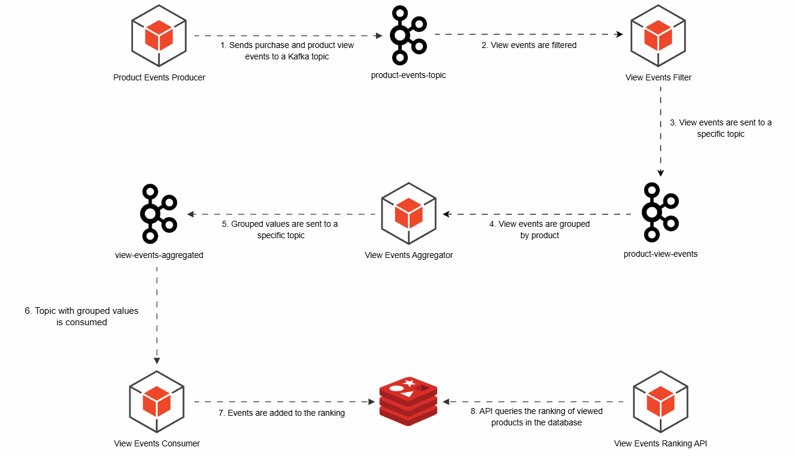

# Ranking of Most Viewed Products

[](./README.md) [](./docs/README.pt-br.md)

## Use Case
An e-commerce platform with a large product catalog and a significant number of view events wants to implement a system to display a ranking of the most viewed products to highlight popular items on the homepage.

## Challenges
1. High volume of events.
2. There is an application that sends purchase and view events to a Kafka topic.
3. The processing must disregard purchase events.
4. It is not possible to modify the application that produces the events.
5. Eventual consistency is acceptable.

## Step-by-step
1. The event producer sends events to the Kafka topic.
2. An application filters only the view events using Kafka Streams.
3. The view events are published to a dedicated topic. Here, we achieve flow isolation, as each event can be sent to its respective topic.
4. Another consumer, using Kafka Streams, groups the events by product. This significantly reduces the load on the database.
5. The grouped events are sent to an aggregation topic.
6. An application consumes the aggregated events topic.
7. It saves the data in a database. In this case, we are using a Redis instance dedicated solely to the ranking.

Due to grouping process, there will only be one operation per product (within the aggregation window), significantly reducing the number of database operations.

## Solution diagram


## Running the project

1 . Run the necessary containers for the application
```bash
$ docker-compose up -d
```

2. Access Kafdrop and register the necessary topics
````
http://localhost:19000

Create the topics:
- product-events-topic
- product-view-events-topic
- product-view-events-aggregated-topic
````

3. Run the application through the Main.java file

4. Connect to Redis and list the Top 5 most visualized products
`````bash
127.0.0.1:6379> ZREVRANGE products:events:view:ranking 0 4 WITHSCORES
# Return example
 1) "4"
 2) "59695"
 3) "7"
 4) "59464"
 5) "12"
 6) "58839"
 7) "9"
 8) "58538"
 9) "17"
10) "58508"
`````
