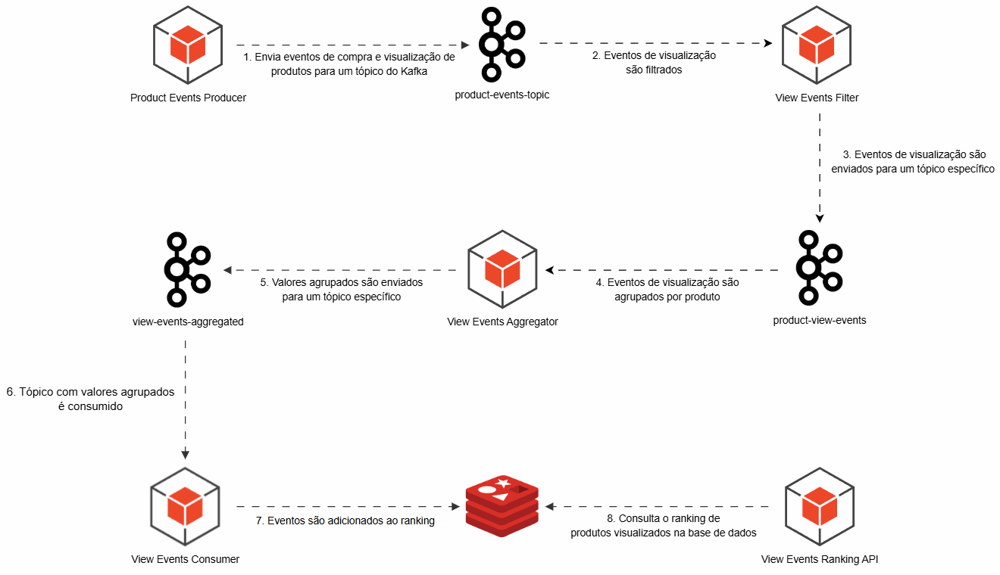

# Ranking de visualização de produtos com Kafka

[](../README.md) [](README.pt-br.md)

## Caso de Uso
Um e-commerce com um catálogo amplo de produtos e uma quantidade de eventos de visualização considerável deseja implementar um sistema para exibir um ranking dos produtos mais visualizados para destacar os produtos mais populares na página inicial.

## Desafios
1. Alto volume de eventos.
2. Existe uma aplicação que envia eventos de compra e venda para um tópico do Kafka.
3. O processamento deve desconsiderar eventos de compra.
4. Não é possível alterar a aplicação que produz os eventos.
5. Consistência eventual é suportada.

## Passo-a-passo
1. O produtor de eventos envia os eventos para o tópico do Kafka.
2. Uma aplicação filtra apenas os eventos de visualização utilizando Kafka Streams.
3. Os eventos de visualização são publicados em um tópico exclusivo. Aqui, conseguimos o isolamento de fluxos, uma vez que podemos enviar cada evento para seu respectivo tópico.
4. Um outro consumidor, utilizando Kafka Streams, realiza um agrupamento dos eventos por produto. Isso possibilita reduzir consideravelmente a carga no banco de dados.
5. Os eventos agrupadas são enviadas para um tópico de agregação.
6. Uma aplicação consome o tópico dos eventos agregados.
7. salva em uma base de dados. Nesse caso, estamos utilizando um redis dedicado apenas ao ranking.

Graças ao agrupamento, teremos apenas um processamento por produto (dentro da janela de tempo do agrupamento), diminuindo consideravelmente a quantidade de operações no banco de dados.

## Diagrama da solução


## Rodando o Projeto

1 . Execute os containers necessários para a aplicação
```bash
$ docker-compose up -d
```

2. Acesse o Kafdrop e cadastre os tópicos necessários:
````
http://localhost:19000

Crie os tópicos:
- product-events-topic
- product-view-events-topic
- product-view-events-aggregated-topic
````

3. Rode a aplicação através do arquivo Main.java

4. Se conecte ao redis e liste o Top 5 Produtos mais visualizados.
`````bash
127.0.0.1:6379> ZREVRANGE products:events:view:ranking 0 4 WITHSCORES
# Exemplo de retorno
 1) "4"
 2) "59695"
 3) "7"
 4) "59464"
 5) "12"
 6) "58839"
 7) "9"
 8) "58538"
 9) "17"
10) "58508"
`````
